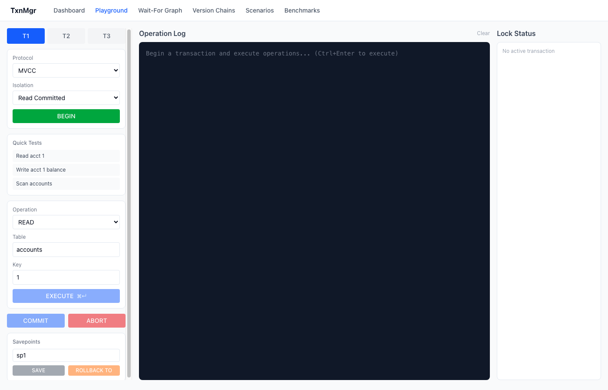
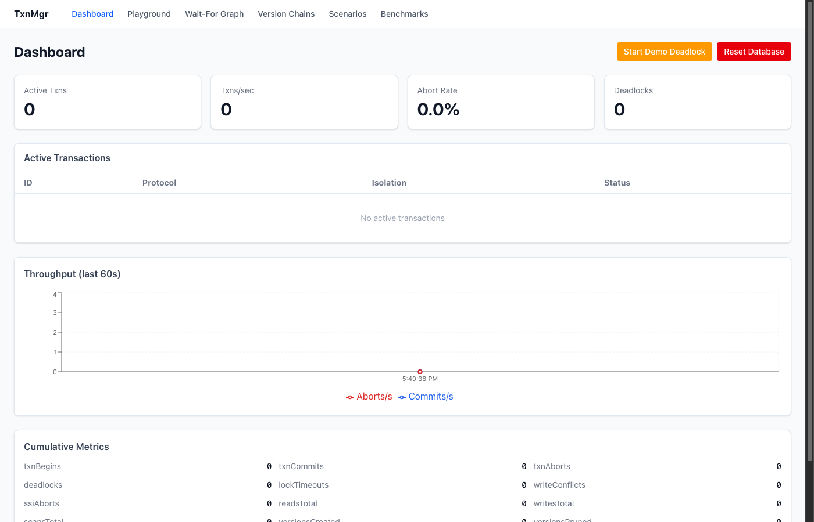
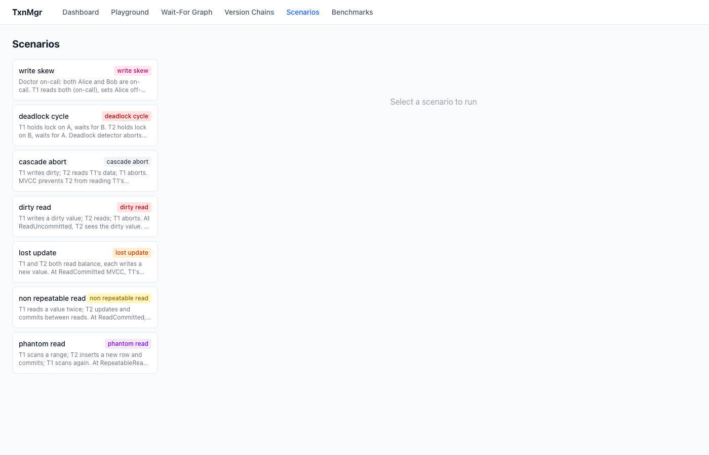
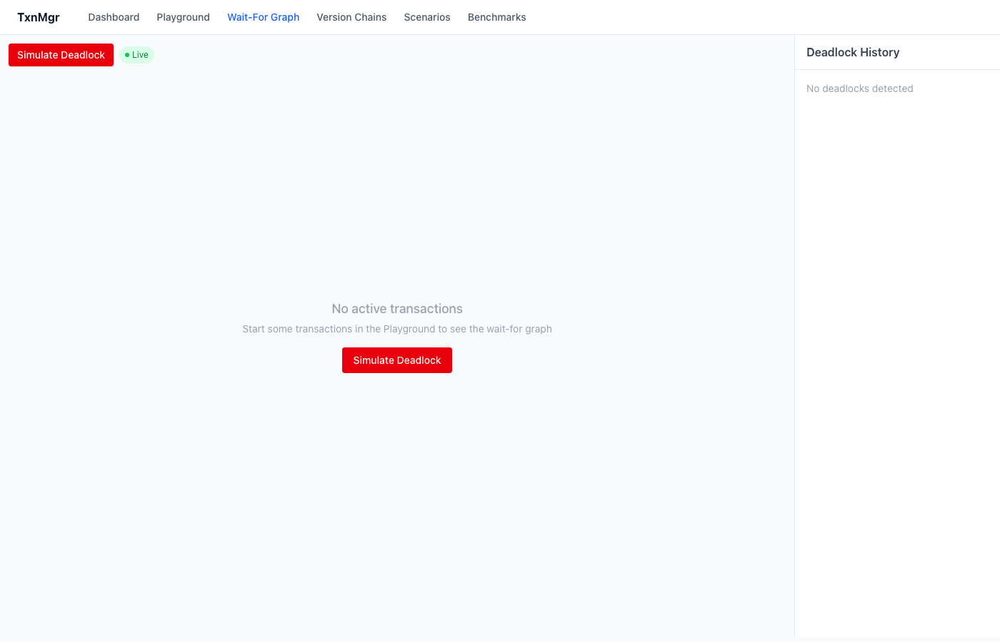
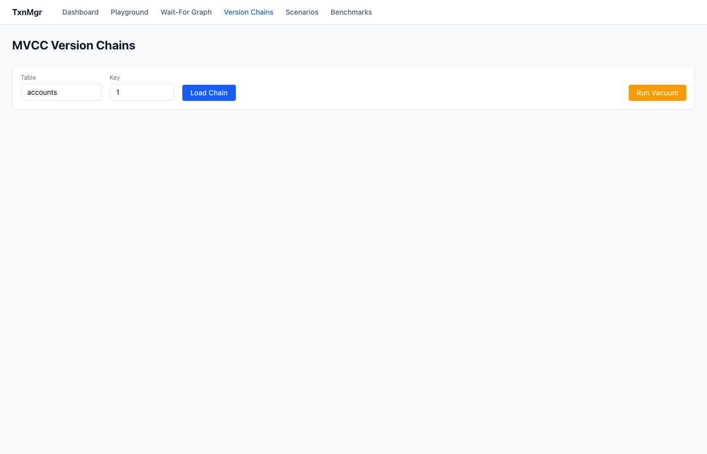

<p align="center">
  
</p>

<h1 align="center">Transaction Manager</h1>

<p align="center">
  A production-grade database transaction engine — strict 2PL, MVCC+SSI, WAL, Raft consensus — with an interactive exploration UI.
</p>

<p align="center">
  <a href="https://github.com/sanskarpan/TransactionManager/actions/workflows/ci.yml">
    
  </a>
  &nbsp;
  
  &nbsp;
  
  &nbsp;
  
</p>

<p align="center">
  
</p>

---

Built as both a learning artifact and a real system. Every concurrency anomaly (dirty read, phantom, write skew, deadlock) is reproducible step-by-step in the browser. Every component that matters in a real database is here — WAL with ARIES recovery, a buffer pool with LRU eviction, and Raft consensus for replication — all wired together and race-safe under `-race`.

## Quick start

```bash
# Backend (Go 1.26+)
go run ./cmd/server

# Frontend (separate terminal)
cd web && npm install && npm run dev
```

Open **http://localhost:5173** — the Vite dev server proxies `/api` and `/sse` to `localhost:8080`.

Or with Docker:

```bash
docker build -t txn-manager:latest .
docker run --rm -p 8080:8080 txn-manager:latest
```

---

## What's inside

### Playground — run transactions in your browser

Pick a protocol (2PL or MVCC), pick an isolation level, open up to three concurrent transactions, and execute reads, writes, scans, inserts, and deletes. Lock state updates live. Savepoints and rollback work. Every operation is logged.

<p align="center">
  
</p>

### Anomaly scenarios — see exactly how isolation levels fail

Seven canned scenarios reproduce every classic concurrency anomaly. Each runs the transactions step by step and shows what went wrong (or what the engine prevented).

<p align="center">
  
</p>

| Anomaly | Occurs at | Prevented at |
|---|---|---|
| Dirty Read | Read Uncommitted | Read Committed+ |
| Lost Update | Read Committed (MVCC) | Repeatable Read+ |
| Non-Repeatable Read | Read Committed | Repeatable Read+ |
| Phantom Read | Read Committed | Repeatable Read+ (snapshot) |
| Write Skew | Repeatable Read | Serializable (SSI) |
| Deadlock Cycle | Any (2PL) | N/A — victim aborted |
| Cascade Abort | Read Uncommitted | Read Committed+ |

### Wait-for graph — deadlock detection, live

The deadlock detector runs DFS on the wait-for graph every 50ms. When it finds a cycle it aborts the youngest transaction and records the event. The WFG page renders the graph in real time over SSE.

<p align="center">
  
</p>

### MVCC version chains

Inspect the full version history for any row: every write, the transaction that made it, and whether it is visible to a given snapshot.

<p align="center">
  
</p>

---

## Engine architecture

```
HTTP Client
    │
    ▼
api.Server  (chi router + middleware chain)
├── apiwire: RequestID → AccessLog → MaxBody → CORS → AdminToken
└── handlers: txn lifecycle, row ops, savepoints, scenarios, benchmark, SSE
    │
    ▼
txn.Manager  (orchestrates both protocols)
├── 2PL path:  LockTable → intention locks (IS/IX/S/X/SIX) → FIFO queues
├── MVCC path: VersionChains → visibility predicate → SSI rw-anti-dep graph
├── WAL:       write-ahead log (group commit, ARIES recovery) ← opt-in via WAL_DIR
├── Storage:   TableIface → Table (in-memory) | PagedTable (buffer pool + heap)
└── Raft:      consensus layer, leader election, log replication ← opt-in via RAFT_MODE
    │
    ├── DeadlockDetector  (50ms DFS cycle detection, victim = youngest txn)
    └── Vacuum            (30s background pruning of dead MVCC versions)
```

### Packages

```
cmd/server/        Entry point — slog, graceful shutdown, env-var wiring
api/               HTTP handlers (chi), public-error sanitizer
api/apiwire/       Middleware: RequestID, AccessLog, MaxBody, CORS, AdminToken
internal/
  lock/            Lock table, wait queues, FIFO fairness, intention-lock matrix
  deadlock/        Wait-for graph, DFS detector, deadlock history
  mvcc/            Version chains, visibility, vacuum, empty-chain reaper
  isolation/       SSI tracker — SIREAD locks + rw-anti-dependency edges
  txn/             TxnManager, savepoints, undo log, 2PL+MVCC orchestration
  storage/         TableIface, in-memory Table, PagedTable, HeapFile, BufferPool
  wal/             LSN, log records, group-commit manager, ARIES recovery
  raft/            Leader election, log replication, TCP+gob transport, FSM
  scenario/        7 anomaly scenarios with step-by-step execution trace
  metrics/         Atomic counters, latency histogram
  types/           Value, TxnError, error codes, binary encoding
benchmark/         TPC-B workload with balance invariant verification
web/               React + TypeScript + Tailwind + Vite frontend
docs/              ADRs, RUNBOOK, audit reports
```

---

## Protocols and isolation levels

| | 2PL | MVCC |
|---|---|---|
| Read Uncommitted | lock-free dirty reads | — |
| Read Committed | S lock on read, released after | snapshot on each statement |
| Repeatable Read | S lock held until commit | snapshot on transaction begin |
| Serializable | 2PL + gap locks | MVCC + SSI (SIREAD + anti-dep) |

**2PL** uses strict two-phase locking with intention locks (`IS`/`IX`/`S`/`X`/`SIX`) on both the table and row resources. Lock acquisition is FIFO to prevent starvation.

**MVCC** maintains a per-key version chain. Readers never block writers. SSI detects write-skew by tracking rw-anti-dependency edges and aborting one transaction in any dangerous cycle.

---

## Persistence (opt-in)

By default everything is in-memory. Set env vars to enable disk persistence:

```bash
# WAL + ARIES crash recovery
WAL_DIR=/var/lib/txnmgr/wal go run ./cmd/server

# Paged storage (buffer pool + heap files)
STORAGE_MODE=paged WAL_DIR=/var/lib/txnmgr go run ./cmd/server

# Raft replication (3-node cluster)
RAFT_MODE=cluster \
RAFT_ID=node1 \
RAFT_PEERS="node1=:9091,node2=:9092,node3=:9093" \
RAFT_DATA_DIR=/var/lib/txnmgr/raft \
RAFT_LISTEN_ADDR=:9091 \
go run ./cmd/server
```

### WAL — group-commit + ARIES

Log records are flushed with a 2ms group-commit window: multiple concurrent writers share a single `fsync`. On restart, ARIES three-pass recovery (Analysis → Redo → Undo) replays committed writes and rolls back anything that was in-flight at crash time.

### Buffer pool — WAL-before-page

A fixed LRU frame pool backs the heap files. Before any dirty page is written to disk, the WAL flush is forced to the page's LSN — the WAL-before-page rule guarantees recoverability.

### Raft — leader election + log replication

A standard Raft implementation over raw TCP (`encoding/gob` framing). Randomized election timeout (150–300ms), 50ms heartbeat. HTTP write handlers propose to Raft first; the FSM applies committed entries to the transaction manager deterministically on all nodes.

---

## Configuration

All configuration is environment variables — no flags, no config files.

| Variable | Default | Description |
|---|---|---|
| `LISTEN_ADDR` | `:8080` | HTTP bind address |
| `ADMIN_TOKEN` | *(empty)* | Token for destructive endpoints (`/api/reset`, `/api/benchmark/run`). Must be ≥ 16 bytes; empty = open (dev only). |
| `CORS_ALLOW_ORIGINS` | `*` | Comma-separated allowed origins. |
| `LOG_LEVEL` | `INFO` | `DEBUG`/`INFO`/`WARN`/`ERROR` |
| `TLS_CERT_FILE` | *(empty)* | TLS cert path (set with `TLS_KEY_FILE` to enable HTTPS). |
| `TLS_KEY_FILE` | *(empty)* | TLS key path. |
| `WAL_DIR` | *(empty)* | Enable WAL. Path to log directory. |
| `STORAGE_MODE` | `memory` | `memory` or `paged` (requires `WAL_DIR`). |
| `BUFFER_POOL_SIZE` | `1000` | LRU frames (4 MB at 4 KB/page). |
| `RAFT_MODE` | `off` | `off`, `single`, or `cluster`. |
| `RAFT_ID` | *(empty)* | Node identity string. |
| `RAFT_PEERS` | *(empty)* | `id=addr,id=addr,...` for cluster peers. |
| `RAFT_DATA_DIR` | *(empty)* | Path for Raft log + persistent state. |
| `RAFT_LISTEN_ADDR` | *(empty)* | TCP address for Raft RPCs. |

---

## API

| Method | Path | Auth | Description |
|---|---|---|---|
| GET | `/healthz` | — | Liveness |
| GET | `/readyz` | — | Readiness |
| POST | `/api/txn/begin` | — | Begin transaction |
| POST | `/api/txn/{id}/commit` | — | Commit |
| POST | `/api/txn/{id}/abort` | — | Abort |
| GET | `/api/txn/{id}/status` | — | Status |
| POST | `/api/txn/{id}/read` | — | Read a row |
| POST | `/api/txn/{id}/write` | — | Write a row |
| POST | `/api/txn/{id}/scan` | — | Table scan |
| POST | `/api/txn/{id}/insert` | — | Insert |
| POST | `/api/txn/{id}/delete` | — | Delete |
| POST | `/api/txn/{id}/savepoint` | — | Create savepoint |
| POST | `/api/txn/{id}/rollback-to` | — | Rollback to savepoint |
| GET | `/api/locks` | — | All lock queues |
| GET | `/api/wfg` | — | Wait-for graph snapshot |
| GET | `/api/deadlocks` | — | Deadlock history |
| GET | `/api/mvcc/chain/{table}/{key}` | — | Version chain |
| GET | `/api/metrics` | — | Metrics |
| POST | `/api/mvcc/vacuum` | **admin** | Trigger vacuum |
| POST | `/api/reset` | **admin** | Reset + reseed |
| GET | `/api/scenarios` | — | List scenarios |
| POST | `/api/scenarios/{name}/run` | — | Run scenario |
| POST | `/api/benchmark/run` | **admin** | Start TPC-B |
| GET | `/sse/events` | — | SSE event stream |
| GET | `/sse/wfg` | — | SSE wait-for-graph |

Every response carries `X-Request-ID`. Error bodies are `{"error": "..."}` — internal details are logged server-side, never leaked.

```json
POST /api/txn/begin
{ "protocol": "mvcc", "isolation": "serializable", "lockTimeoutMs": 5000 }
```

---

## Tests

```bash
go test ./... -race            # full suite with race detector
go test ./... -coverprofile=c.out && go tool cover -func=c.out
go test ./benchmark -bench=. -benchmem -benchtime=5s

# Fuzz (30s smoke)
go test ./api -fuzz=FuzzParseTxnID -fuzztime=30s -run='^$'
go test ./api -fuzz=FuzzIsolationFromString -fuzztime=30s -run='^$'
```

Or via Make:

```bash
make test      # unit
make race      # race detector
make coverage  # coverage report
make bench     # benchmarks
make ci-local  # full CI parity
```

---

## License

MIT — see [LICENSE](LICENSE).
